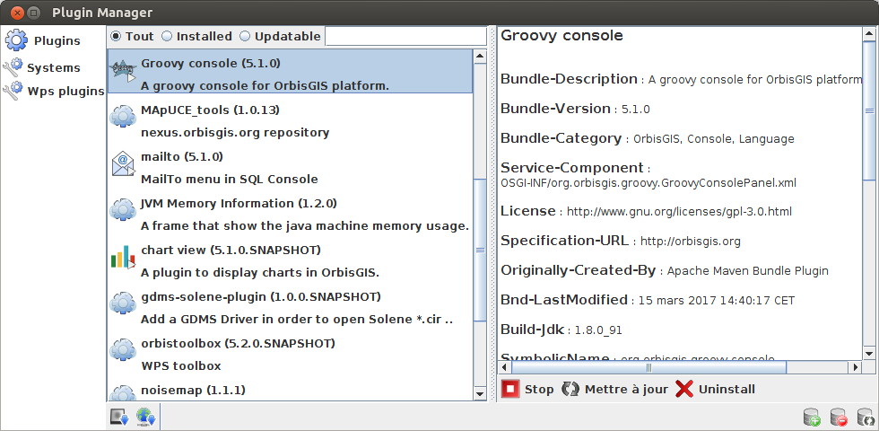

# Official OrbisGIS plugins

This repository contains a set of optional and official plugins to extend OrbisGIS 5.X with new features.

These plugins are up to date with the OrbisGIS plugins manager.


## Organization

In each plugin's folder, you have:
* ```src``` folder : the source code,
* ```pom.xml``` file : configuration file for MAVEN (dependancies, ...),
* ```README.md``` file : the plugin's documentation in english. Optionnaly, you can have additionnal README_XX.md file for XX translation,
* ```img``` folder : potential images shown in the documentation.


## Install a plugin

To install a plugin, you have to launch the "Plugin manager" which is in the "Tools" menu of OrbisGIS.



Here, you can:
* search plugins thanks to the engine,
* filter all, installed or updatable plugins,
* add a plugin from an url / from the disk (in both cases, dependancies will not be automatically resolved),
* add/remove/update a remote bundle repository,
* download/start/stop/update/uninstall a plugin.
