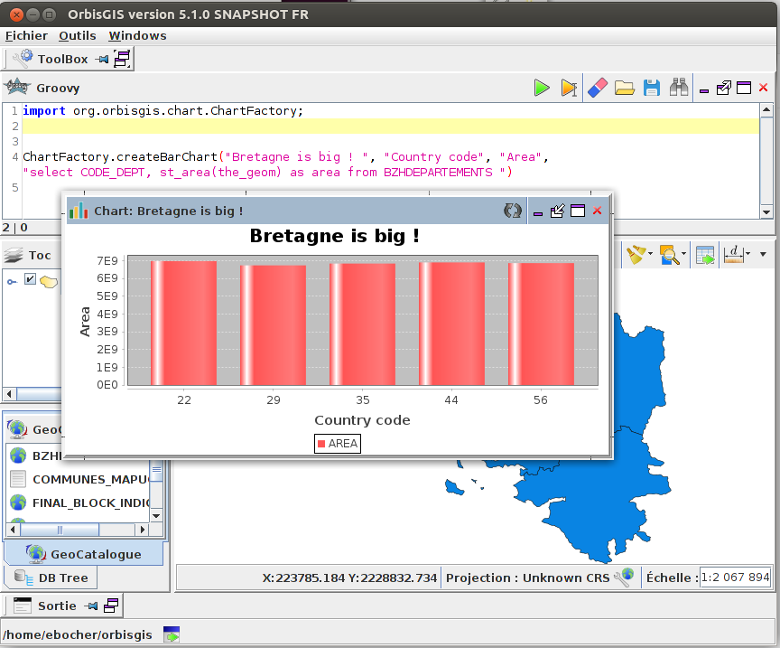
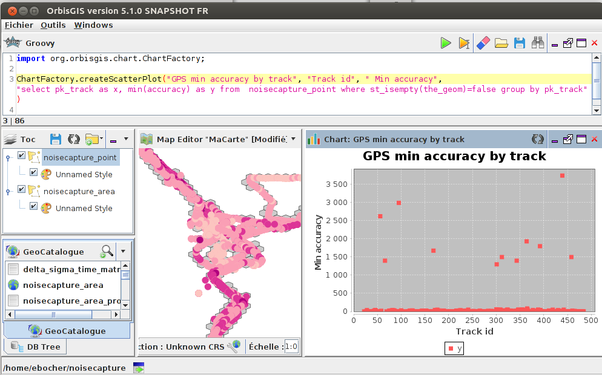
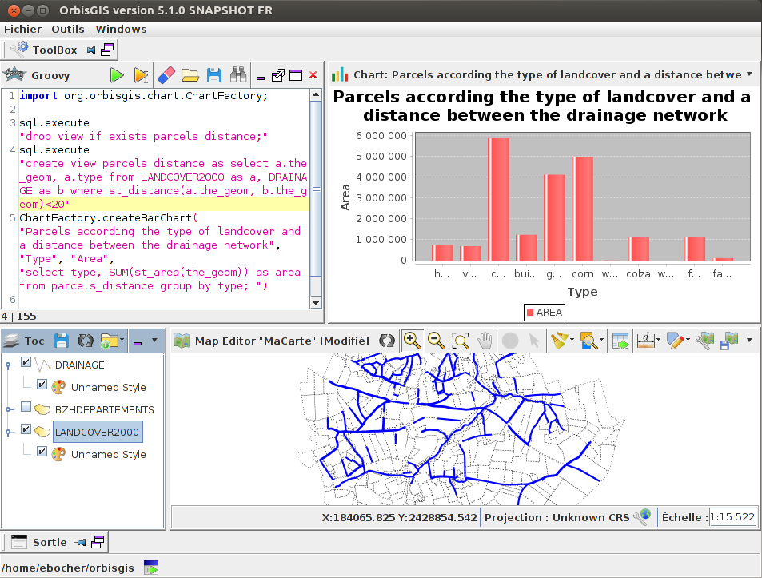
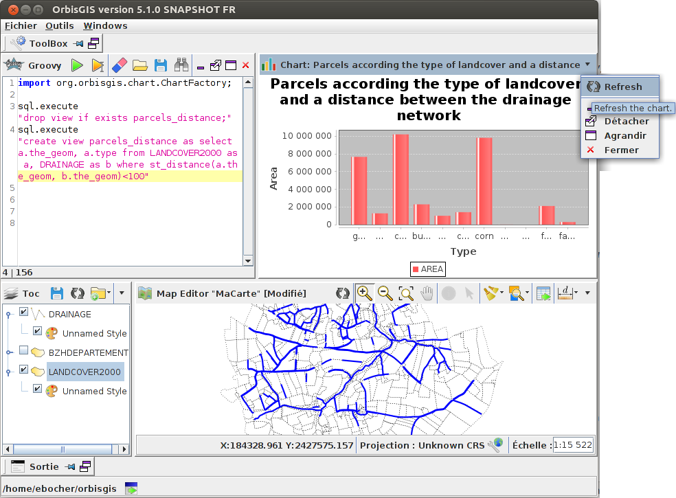

# Chart-view plugin

## Introduction

The "Chart view" plugin makes charts available to use in OrbisGIS, thanks to  [JFreeChart](http://www.jfree.org/jfreechart/).
This plugin offers a simple way to create charts from the current OrbisGIS database.


## Install

To install the "Chart view", please use at least the OrbisGIS 5.1.X version.

Then, go to the menu "Tools/Manage plugins" and search "Chart view" and press "Download & Start".

The "Chart view" currently doesn't offert any GUI wizard but a chart factory service to create charts from any point in OrbisGIS.


## In action


### How to create a barchart ?


In the "Groovy console" execute

```groovy
//Import the ChartFactory class
import org.orbisgis.chart.ChartFactory;

//Create the bar chart
ChartFactory.createBarChart("Bretagne is big ! ", "Country code", "Area", "select CODE_DEPT, st_area(the_geom) as area from BZHDEPARTEMENTS ") 
```




### How to create a scatter plot ?


In the "Groovy console" execute

```groovy
//Import the ChartFactory class
import org.orbisgis.chart.ChartFactory;

//Create the scatter plot
ChartFactory.createScatterPlot("GPS min accuracy by track", "Track id", " Min accuracy", "select pk_track as x, min(accuracy) as y from  noisecapture_point where st_isempty(the_geom)=false group by pk_track") 
```




### How to reload a chart ?


In the "Groovy console" execute

```groovy
import org.orbisgis.chart.ChartFactory;

sql.execute "drop view if exists parcels_distance"
sql.execute "create view parcels_distance as select a.the_geom, a.type from LANDCOVER2000 as a, DRAINAGE as b where st_distance(a.the_geom, b.the_geom)<20"
ChartFactory.createBarChart("Parcels according the type of landcover and a distance between the drainage network", "Type", "Area", "select type, SUM(st_area(the_geom)) as area from parcels_distance group by type; ")
```



Re-run the SQL queries and clic on the reload buton in the chart view


```groovy
import org.orbisgis.chart.ChartFactory;

sql.execute "drop view if exists parcels_distance"
sql.execute "create view parcels_distance as select a.the_geom, a.type from LANDCOVER2000 as a, DRAINAGE as b where st_distance(a.the_geom, b.the_geom)<100"

```




## Acknowledgements


We would like to thank the [JFreeChart developer](https://twitter.com/david_m_gilbert) who provides to the opensource community this powerfull chart library.
