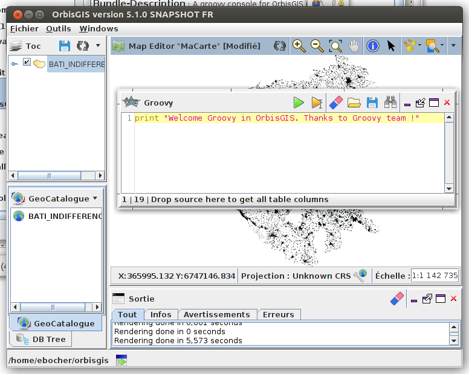

# Groovy Console plugin

## Introduction

The "Groovy console" makes [Groovy language](http://www.groovy-lang.org/) available to use in OrbisGIS.
Groovy is a dynamic object-oriented programming language for the Java virtual machine (JVM). The language can be used to interact with OrbisGIS, create functions or write new applications.


## Install


To install the "Groovy console", please use at least the OrbisGIS 5.1.X version.

Then, go to the menu "Tools/Manage plugins" and search "Groovy console" and press "Download & Start".

Go to the menu "Windows" and check the "Groovy console".




## Implementation

The "Groovy console" implements the GroovyShell class that represents a shell capable of running arbitrary groovy scripts (see http://groovy-lang.org/api.html). 
To facilitate the use of the "Groovy console", two variables and one property are exposed to the shell.

### Variables

**Name : mc**

Description : Refer to the current MapContext object. It allows the user to manage layers and styles.

**Name : pm**

Description : Allow the access to the RootProgressMonitor in OrbisGIS. User can canceled property and listeners.


### Property

**Name : sql**

Description : Instance of the [Groovy Sql object](http://docs.groovy-lang.org/latest/html/api/groovy/sql/Sql.html) populated with the current OrbisGIS database connection. User are able to execute sql queries. 


## In actions

How to query a table available in OrbisGIS ?


Note : The print trace is piped to the OrbisGIS output window.


How to create a buffer on geometry and print the result?

```groovy
sql.eachRow("select the_geom from BATI_INDIFFERENCIE LIMIT 1;"){ row ->
print row.the_geom.buffer(10)
}

```

How to print a result in a file?

```groovy
def file_dump= new File('/tmp/dump_buffer.txt')
sql.eachRow("select the_geom from BATI_INDIFFERENCIE LIMIT 1;"){ row ->
file_dump << row.the_geom.buffer(10)
}
```

How to get the name of the first layer available in the TOC ?

```groovy
print mc.getLayers()[0].getName()
```

How to create a layer based on a SQL query ?

```groovy
import org.orbisgis.coremap.layerModel.ILayer;
sql.execute "Create table test as select * from BATI_INDIFFERENCIE limit 2"
ILayer layer = gmc.createLayer("test");
mc.getLayerModel().addLayer(layer);
```

How to set a custom style to layer?

```groovy
import org.orbisgis.coremap.layerModel.ILayer;
import org.orbisgis.coremap.renderer.se.*;

ILayer layer = mc.getLayers()[0]
layer.setStyle(0,new Style(layer, "/tmp/mypolygonstyle.se"));
mc.getLayerModel().addLayer(layer);
```


## Acknowledgements


We would like to thank the [Groovy community](http://groovy-lang.org/community.html) who provides this incredible scripting language.
