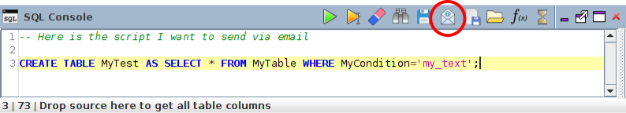
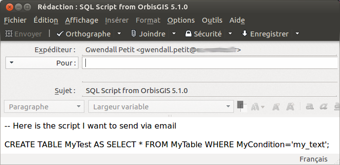

# Plugin Mailto

Ce plugin permet de transmettre via email, le contenu de votre console SQL.

## Installer

Pour installer le plugin "Mailto", veuillez utiliser au minimum la version 5.1.x d'OrbisGIS.

Dans le gestionnaire de plugin, cherchez "mailto" puis cliquez sur "Télécharger & Démarrer".

## Comment l'utiliser

Ce plugin est disponible via la console SQL.

Après avoir écrit votre script SQL, cliquez sur l'icone dédié (cercle rouge).

Cela va ouvrir votre client de messagerie (ex Thunderbird, Outlook, ...) avec un email pré-remplit qui est prêt à être envoyé. Vous avez juste à renseigner la liste des destinataires.

