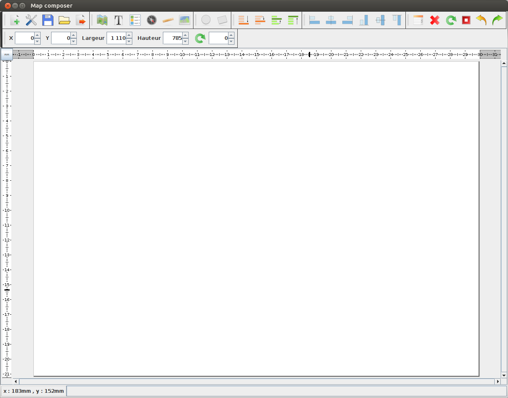
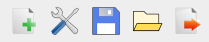
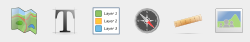
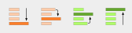
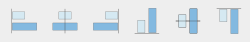
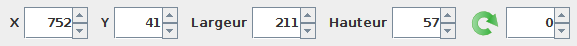
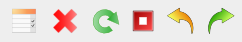
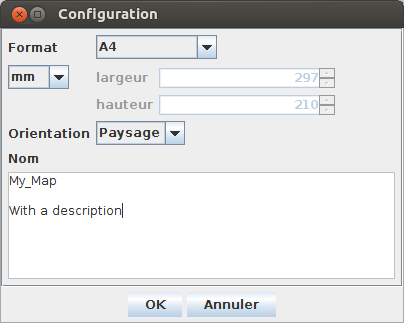
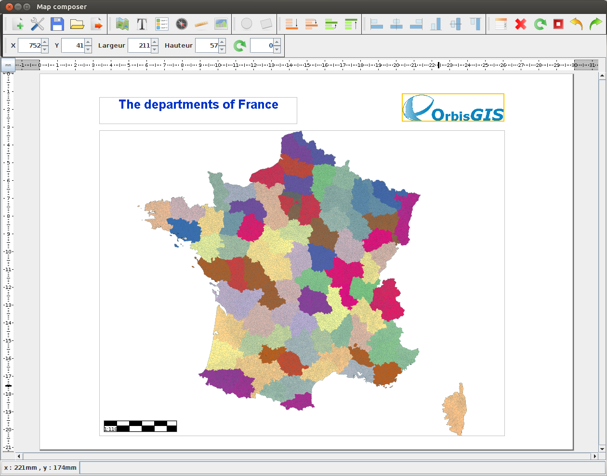

# Map Composer plugin

## Introduction

The "Map Composer" plugin allows to create cartographic documents (usually called "a map"). Here, such a document is made of:
* a map context: the content displayed in the map window of OrbisGIS. A map context is structured as an .ows file, which fit with a custom version of [OGC OWS-Context](http://www.opengeospatial.org/standards/owc) standard, available [HERE](https://github.com/orbisgis/ogc-custom-jaxb/tree/master/src/main/resources/owc),
* additionnal elements such as title, scale, orientation, ...

## Install

To install the "Map Composer", please use at least the OrbisGIS 5.1.X version.

Then, go to the menu "Tools/Manage plugins" and search "Map Composer" and press "Download & Start".

Go to the menu "Tools" and check the "Map Composer".

## Toolbar

In the toolbar, you have icons to ...

### ... manage the cartographic document

* create a new document,
* configure a document,
* save a document,
* open a document,
* export a document in .pdf (vector or raster) or image (.png, .jpg, .gif).

### ... add elements to the cartographic document

* add a map context,
* add text,
* add a legend *(not available right now)*,
* add the orientation,
* add a scale,
* add a picture.

* add a circle,
* add a rectangle.

### ... organize elements

* bottom,
* down,
* up,
* top.

### ... align elements

* left / horizontal center / right,
* bottom / vertical center / top .

### ... manage selected object(s)

* move the element with x / y coordinates,
* define the size (width / height),
* rotate.

### ... other actions

* display properties of selected object(s),
* remove selected object(s),
* redraw selected object(s),
* cancel the rendering,
* undo,
* redo.

## In action

### Create a new cartographic document

Once you open the Map Composer, you have first to create a new cartographic document. To do this, click on the first icon (on the left in the toolbar). Here a new "Configuration" panel appears.

You are invited to specify:
* the format,
* the size (widht/height) *(if needed)*,
* the orientation,
* the name.

Press "OK" to finish.

### Fill the document

Then, you can fill the cartographic document with the map context (the map you have in OrbisGIS) and other elements such as title, scale, ...

To add an element, follow these steps:
1. click on the icon,
2. in the new panel, configure your element and click on "OK",
3. with the mouse, draw a rectangle which will correspond to the element's extent.

