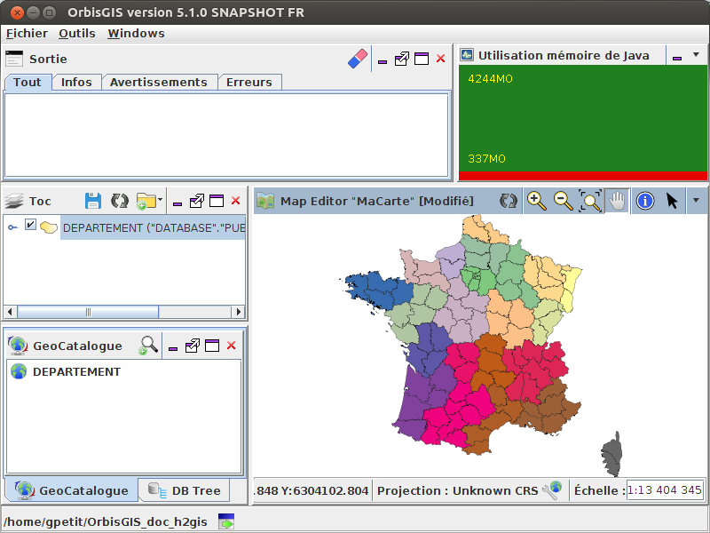

# Java Memory plugin

## Introduction

The "JVM Memory Information" plugin allows users to visualize the way OrbisGIS consume the memory used to display, search and process data.

## Install

To install the "Java memory Information" plugin, please use at least the OrbisGIS 5.1.X version.

Then, go to the menu "Tools/Manage plugins" and search "JVM Memory Information" and press "Download & Start".

## Use

Go to the menu "Windows" and check "Use of Java memory".

Here you have a new panel with the visual representation of the memory allocated by Java (green) and consumed by OrbisGIS (red).

