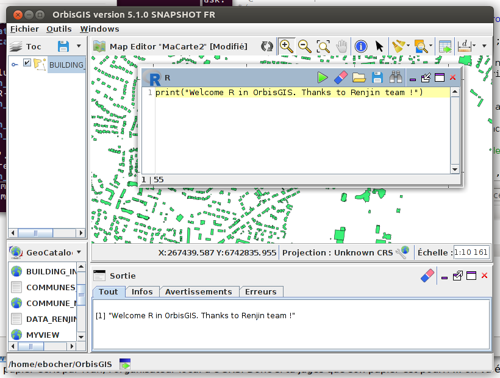
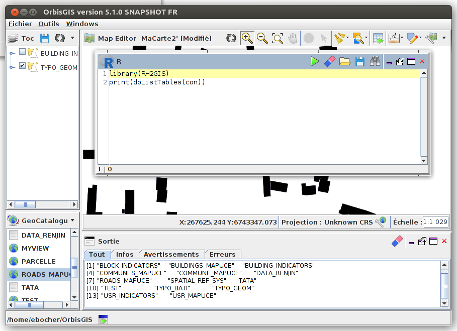

# R Console plugin


## Introduction

The "R console" makes [R](www.r-project.org) available to use in OrbisGIS. "R console" is based on [Renjin](http://www.renjin.org/). Renjin is a JVM-based interpreter for the R language for statistical computing.


## Install

To install the "R console", please use at least the OrbisGIS 5.1.X version.

Then, go to the menu "Tools/Manage plugins" and search "R console" and press "Download & Start".

Go to the menu "Windows" and check the "R console".




## Implementation

"R console" is able to interact with the current OrbisGIS database, thanks to [Renjin-DBI](https://github.com/hannesmuehleisen/renjin-dbi) package. Renjin-DBI (R-DBI) offers various database interfaces including RPostgreSQL and RH2GIS.
To facilitate the connection between OrbisGIS database and the Renjin script engine (that executes the R code), a variable named ```con``` is pushed to the [ScriptEngine](http://docs.renjin.org/en/latest/library/evaluating.html) instance.
The ```con``` variable is a ```java.sql.Connection``` wrapped as a R ```ExternalPtr``` (See [Pushing data from Java to R](http://docs.renjin.org/en/latest/library/moving-data-between-java-and-r-code.html)).

The R console used a specific OSGI bundle named [r-engine](https://github.com/orbisgis/orbisgis-plugin_views/tree/master/r-engine) and build by the OrbisGIS team. You might have a shifted version compared to the master repository of Renjin. We are doing our best to keep it updated but if you need a newer version, feel free to contribute with us or the Renjin team to improve that.

## In actions

### How to list the tables available from the default H2GIS database ?

Execute

```R
# Load the DBI package
library(RH2GIS)
print(dbListTables(con))
# con is the java.sql.Connection  wrapped as R ExternalPtr
# the print trace is displayed in the OrbisGIS output window.
```




### How to use a single spatial function ?

Execute

```R
library(RH2GIS)
data_area <- dbGetQuery(con, "SELECT ST_AREA(THE_GEOM) AS AREA FROM BUILDINGS_MAPUCE;")
print(summary(data_area))
```

Result

```
      AREA          
 Min.   :     0,22  
 1st Qu.:   69,175  
 Median :  103,865  
 Mean   :  193,214  
 3rd Qu.:   149,11  
 Max.   :43323,395  
```

## Important

The OrbisGIS R console is based on the Renjin interpreter. 

* To known the list of supported R packages, please consult http://packages.renjin.org/
* If you need help on Renjin, go to the  [renjin-dev mailing list](http://groups.google.com/group/renjin-dev)
* If you need specific development on Renjin, please contact info@renjin.org
* If you have any questions about geospatial data, processing, please contact info@orbisgis.org

And feel free to contribute & support Renjin or OrbisGIS ecosystem in whatever manner you choose (donation, PR, documentation, feed-backs...)


## Acknowledgements

We would like to thank 

- The [Renjin](http://www.renjin.org/) team, especially the [BeDataDriven compagny](http://www.bedatadriven.com/),
- Hannes Mühleisen who  creates a set of [R DBI](https://github.com/hannesmuehleisen/renjin-dbi) drivers.
